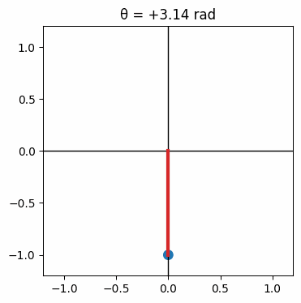
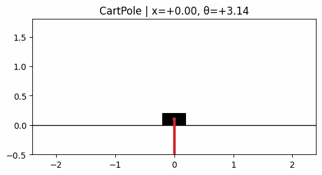

# DDP via PyTorch
Implementation of Differential Dynamic Programming model via PyTorch.
 
Traditional DDP implementations require manually coded Jacobians and Hessians, which are tedious and error-prone. By leveraging PyTorch autograd, this implementation automatically computes gradients (∇V, ∇²V) via torch.func.jacrev / torch.func.jacfwd.

### Visualiztion of pendulum and cartpole
<p align="center">
  
</p>

<p align="center">
  
</p>


## Install

 **Clone the repo**
   ```bash
   git clone https://github.com/noxYJZeng/dpp-via-pytorch.git
   cd dpp-via-pytorch
   ```
  
**Run the example**
   ```bash
   cd examples
   python example.py
   ```

